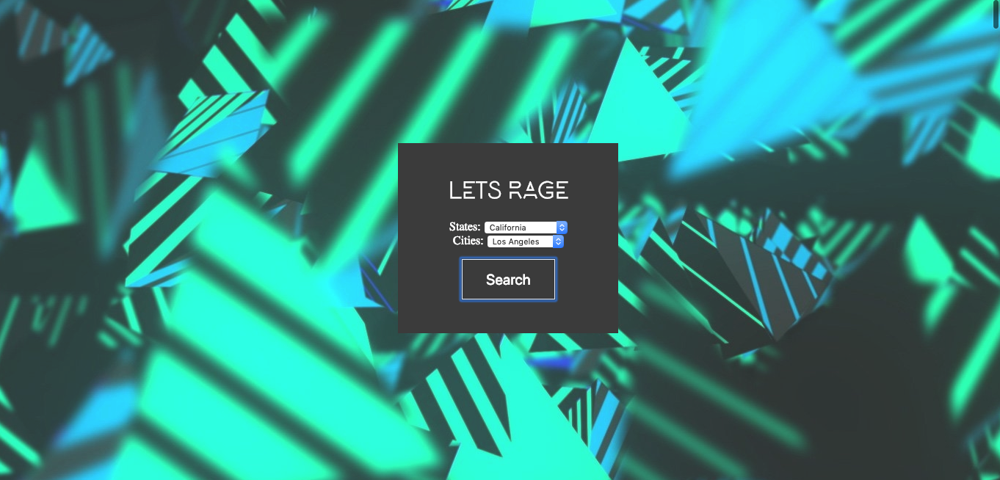
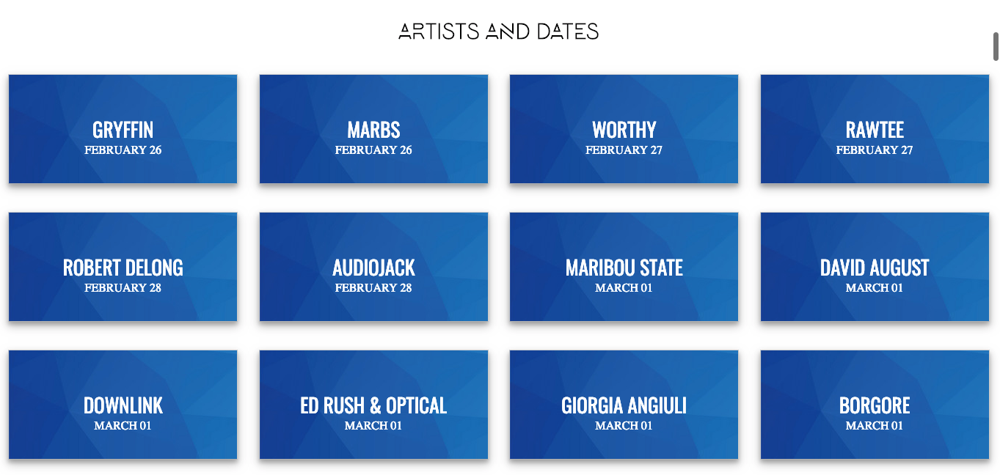
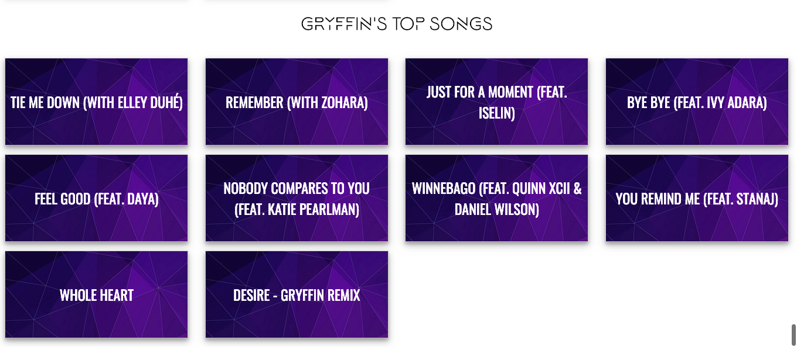

<!-- # book-thing.io

Initial wireframes:

https://wireframe.cc/x0a8I9

https://wireframe.cc/6oVXTU -->
# MusicInfoAPI

Website that is able to display EDM artists in a specific location and be able to listen to their top songs.

## Motivation

Be able to have users to navigate and listen to artists easier.

## Screenshots
Landing Page where user picks state and city:

Artists in specific location:

Top Songs of the Artist:

Youtube Link of the Artist's Song:

## Built With

### Front-End
* HTML
* CSS
* JAVASCRIPT
* JQUERY
* AJAX
* RESPONSIVE DESIGN

## Demo

- [Live Demo](https://wannab3d3v3lop3r.github.io/musicInfoAPI/)

## Authors

* **Christopher Vo** - ** - Front-End development

The goal of this project is the ability to see which EDM artist is playing in a particular area
and be able to listen to its top songs.

Most sites have it where they are able to show where EDM artists playing but doesn't have a way to listen 
to the artist's music at the site. I've made it where its possible to listen to it without having to search. 
After a few clicks, it will direct you to the song on Youtube's page.

Uses EDMTrain, Spotify, and Youtube API.

//USER EXPERIENCE

Users will be able to select certain cities within a state.
They will be able to see which EDM artist will be playing on a particular date.
Once they click on the artist, their top songs will populate.
After clicking on a song, a Youtube video link will show and direct you to the page once clicked.
