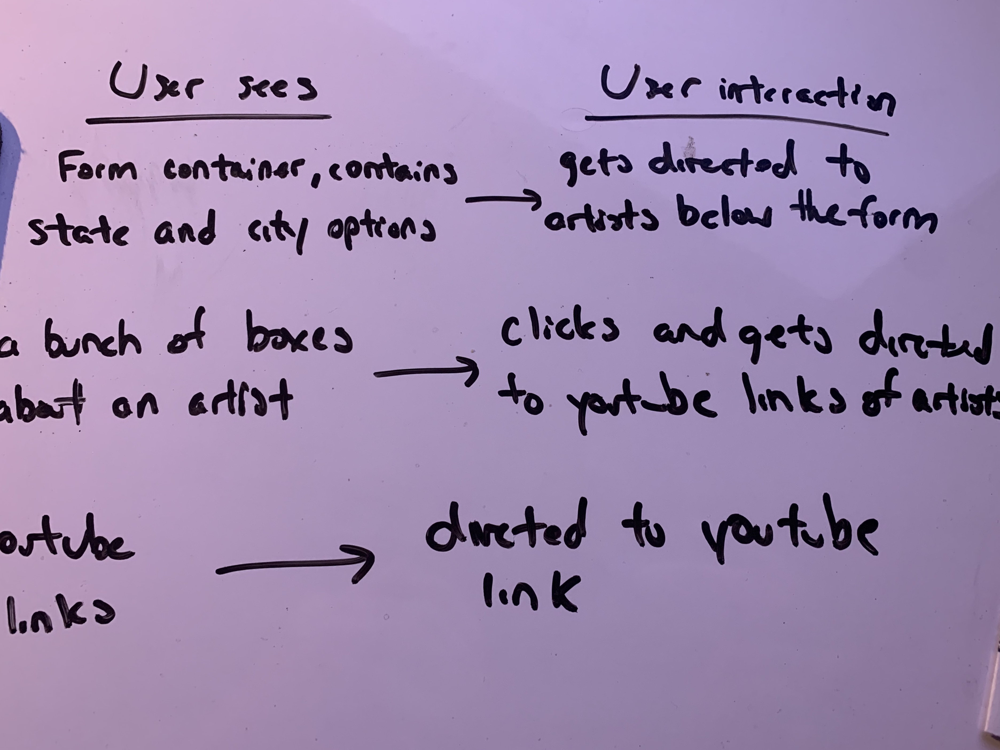

<!-- # book-thing.io

Initial wireframes:

https://wireframe.cc/x0a8I9

https://wireframe.cc/6oVXTU -->
# MusicInfoAPI

The goal of this project is the ability to see which EDM artist is playing in a particular area
and be able to listen to its top songs.

## Motivation

Most sites have it where they are able to show where EDM artists playing but doesn't have a way to listen 
to the artist's music at the site. I've made it where its possible to listen to it without having to search. 
After a few clicks, it will direct you to the song on Youtube's page.

## Screenshots

Userflow

Landing Page where user picks state and city:

Artists in specific location:

Youtube Link of the Artist's

## Built With

### Front-End
* HTML
* CSS
* JAVASCRIPT
* JQUERY
* AJAX
* RESPONSIVE DESIGN CSS

## Demo

- [Live Demo](https://wannab3d3v3lop3r.github.io/musicInfoAPI/)

## Authors

* **Christopher Vo** - ** - Front-End development

## API USED

- EDMTrain (https://edmtrain.com/api-documentation.html)
- Youtube (https://developers.google.com/youtube/)

